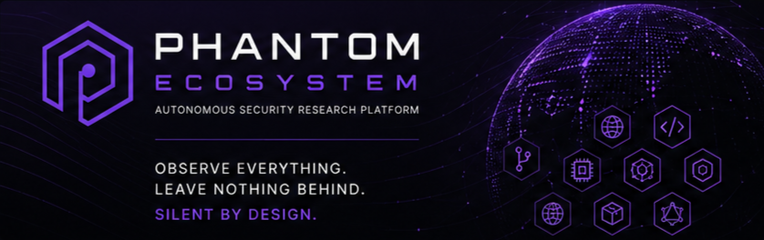

# Phantom Ecosystem

> Official architecture and technical documentation for the Phantom Ecosystem.

<p align="center">
  
</p>

---

# Overview

This repository contains the official architecture and technical documentation for **Phantom Ecosystem**, a modular security research ecosystem composed of specialized autonomous services.

Its purpose is to document the ecosystem architecture, design principles, deployment model, communication patterns, infrastructure, and the responsibilities of each documented module.

---

# Table of Contents

- [Overview](#overview)
- [Repository Scope](#repository-scope)
- [What is Phantom Ecosystem?](#what-is-phantom-ecosystem)
- [Ecosystem Overview](#ecosystem-overview)
- [Architecture](#architecture)
- [Repository Structure](#repository-structure)
- [Documentation](#documentation)
- [Design Principles](#design-principles)
- [Deployment](#deployment)
- [Research](#research)
- [Security](#security)
- [Roadmap](#roadmap)
- [Changelog](#changelog)
- [License](#license)

---

# Repository Scope

This repository serves exclusively as the official architectural reference for Phantom Ecosystem.

It **does not contain source code, executable artifacts, deployment secrets, or operational infrastructure**. The implementation of each module is maintained separately in private repositories.

Keeping the documentation independent from the implementation allows the architecture to remain stable, versioned, and publicly accessible without exposing operational code.

---

# What is Phantom Ecosystem?

Phantom Ecosystem is **a modular security research ecosystem composed of specialized autonomous services with a lightweight event-driven collaboration layer**.

Each service is responsible for a specific domain of security research and operates independently. Selected services also collaborate through a lightweight event-driven communication model.

The ecosystem is designed around modularity, loose coupling, and independent scalability, allowing each service to evolve without introducing unnecessary dependencies across the platform.

Current documented domains include:

- Web assets
- Source code repositories
- Binary analysis
- Mobile applications
- Smart contracts
- JavaScript bundles
- GraphQL endpoints
- Dependency ecosystems
- DNS infrastructure
- CI/CD pipelines
- Machine Learning repositories

---

# Ecosystem Overview

The ecosystem currently documents twelve specialized services, each responsible for a specific domain of security research.

| Module | Responsibility |
|---------|----------------|
| Phantom Core | Asynchronous web crawling and exposed-secret detection |
| Phantom Source | GitHub event and commit-patch secret monitoring |
| Phantom Binary | Software update radar and headless Ghidra analysis |
| Phantom Crypto | Smart-contract monitoring and Slither analysis |
| Phantom Mobile | APK monitoring and JADX-based analysis |
| Phantom AI | Unsafe deserialization and AI credential scanning |
| Phantom Pipeline | GitHub Actions log secret inspection |
| Phantom DNS | Subdomain enumeration and takeover-signature detection |
| Phantom Supply | Dependency confusion discovery and validation |
| Phantom GraphQL | Scheduled and delegated GraphQL introspection analysis |
| Phantom JS | Frontend bundle and client-side secret analysis |
| Phantom Correlation | Stateless event correlation and task delegation |

Each module is documented independently while remaining part of the same ecosystem architecture.

---

# Architecture

The documentation covers the complete architectural model of the ecosystem, including:

- Overall ecosystem architecture
- Deployment topology
- Infrastructure design
- Event communication model
- Correlation engine
- Security model
- Module catalog

Detailed documentation is available under the `docs/` directory.

---

# Repository Structure

```text
PHANTOM_ECOSYSTEM
│
├── assets/
├── docs/
├── infrastructure/
├── modules/
├── research/
│
├── CHANGELOG.md
├── LICENSE
├── README.md
├── ROADMAP.md
└── SECURITY.md
```

---

# Documentation

| Document | Description |
|----------|-------------|
| `docs/index.md` | Documentation index |
| `docs/architecture.md` | Ecosystem architecture |
| `docs/deployment.md` | Deployment model |
| `docs/infrastructure.md` | Infrastructure design |
| `docs/hive-mind.md` | Correlation engine |
| `docs/event-model.md` | Event communication model |
| `docs/security-model.md` | Security architecture |
| `docs/modules.md` | Module catalog |

Each documented module has a concise public entry and a detailed technical document.

```text
modules/<module>/README.md
docs/modules/<module>.md
```

---

# Design Principles

The ecosystem is documented around the following architectural principles:

- Modular architecture
- Single responsibility
- Event-driven communication
- Stateless correlation
- Loose coupling
- Container-first deployment
- Independent scalability
- Asynchronous execution

---

# Deployment

The documented deployment model consists of a containerized environment running as a single Docker Compose stack.

Additional deployment details are available in:

```text
docs/deployment.md
```

---

# Research

The `research/` directory is reserved for sanitized public research notes, technical references, and supporting material. It does not contain operational findings, private targets, internal methodologies, source code, or private research tooling.

See [`research/README.md`](research/README.md) for the directory scope and publication rules.

---

# Security

Security policies and responsible disclosure information are documented in:

```text
SECURITY.md
```

---

# Roadmap

Planned architectural improvements and future development goals are documented in:

```text
ROADMAP.md
```

---

# Changelog

Architectural changes and documentation updates are tracked in:

```text
CHANGELOG.md
```

---

# License

Copyright © 2026 Dimitri Nikolai Bachkatov Droguett.

This repository is licensed under the Apache License 2.0.

The license applies exclusively to the documentation and other contents contained in this repository.

The Phantom Ecosystem implementation, source code, operational infrastructure, and internal research tooling are maintained separately and are **not** included in this repository.

For the complete license terms, see:

```text
LICENSE
```