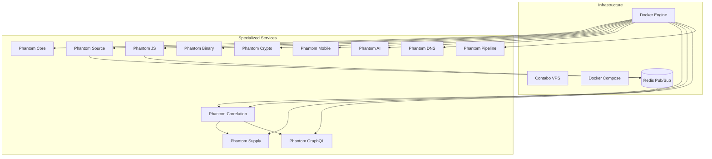
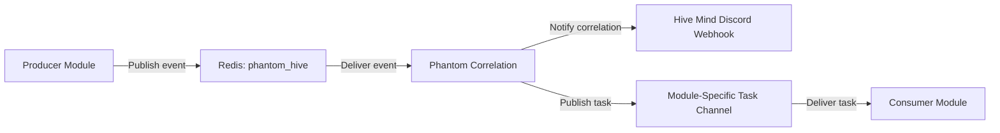
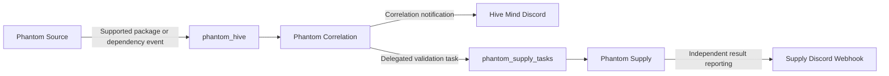
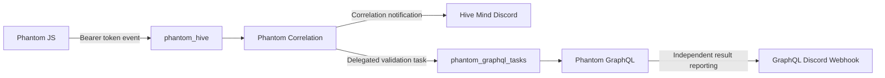
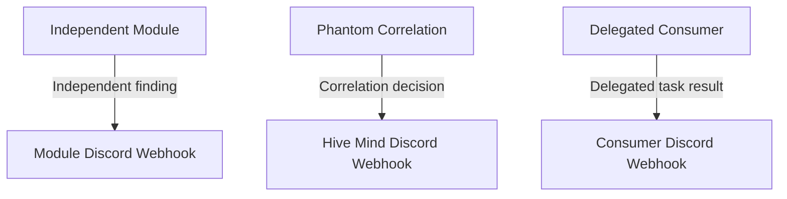

# Architecture

## Purpose

This document describes the implemented architecture of **Phantom Ecosystem**.

It defines the ecosystem structure, infrastructure hierarchy, communication model, module roles, correlation flow, runtime boundaries, and current architectural limitations.

Deployment procedures, event schemas, security controls, and detailed module behavior are documented separately.

---

## Overview

Phantom Ecosystem is **a modular security research ecosystem composed of specialized autonomous services with a lightweight event-driven collaboration layer**.

The ecosystem consists of twelve containerized services deployed on a single VPS. Each service is responsible for a specific security research domain and operates independently from the other modules.

Most modules execute their own monitoring or analysis workflows and report findings directly to their dedicated Discord webhooks.

A subset of modules also participates in the internal event-driven architecture. These services publish intelligence to Redis or consume tasks generated by the Phantom Correlation Engine.

The current architecture combines:

- Independent asynchronous services
- A shared internal Docker network
- Redis Pub/Sub communication
- Stateless event correlation
- Topic-based task delegation
- Direct Discord notifications
- A container-first deployment model

---

## Architectural Hierarchy

The architecture is organized into four primary levels:

```text
Phantom Ecosystem
        │
        ▼
Infrastructure
        │
        ▼
Communication and Correlation
        │
        ▼
Specialized Services
```

These levels represent different responsibilities within the ecosystem.

| Level | Responsibility |
|-------|----------------|
| Ecosystem | Defines the complete security research environment |
| Infrastructure | Provides the host, container runtime, orchestration, and network |
| Communication and Correlation | Transports intelligence and delegates correlated tasks |
| Specialized Services | Perform monitoring, analysis, validation, and reporting |

---

## High-Level Architecture



> All twelve Phantom services are connected to `phantom_net` and have network access to Redis. Network connectivity does not imply active participation in the event flow.

---

## Infrastructure Architecture

### Host Environment

The complete ecosystem runs on a single Contabo VPS.

The VPS provides the host environment for:

- Docker Engine
- Docker Compose
- Redis
- Twelve Phantom service containers
- The internal Docker bridge network

The current architecture does not distribute active services across multiple physical or virtual servers.

---

### Docker Engine

Docker Engine provides the container runtime for the ecosystem.

Each service runs within its own containerized environment. This isolates module dependencies while allowing all services to share the same internal communication network.

The container model provides separation between:

- Module runtimes
- Module dependencies
- Environment variables
- Analysis tools
- Individual execution lifecycles

---

### Docker Compose

Docker Compose defines and starts the complete deployment as a single stack.

The Compose deployment manages:

- Service creation
- Container startup
- Internal networking
- Redis availability
- Service dependencies
- Runtime environment configuration

The active deployment is managed through the monolithic Compose configuration.

Legacy host-based deployment mechanisms are not part of the current runtime architecture.

---

### Internal Network

All containers are attached to a Docker bridge network named:

```text
phantom_net
```

This network provides internal service discovery and communication between the Phantom modules and Redis.

Containers communicate using their Docker service names rather than public host addresses.

The internal network contains:

- Redis
- Phantom Correlation
- Phantom Core
- Phantom Source
- Phantom Binary
- Phantom Crypto
- Phantom Mobile
- Phantom AI
- Phantom Pipeline
- Phantom DNS
- Phantom Supply
- Phantom GraphQL
- Phantom JS

---

## Service Architecture

The ecosystem contains twelve specialized services.

| Service | Primary responsibility |
|---------|------------------------|
| Phantom Core | Web crawling and secret discovery |
| Phantom Source | Source code event monitoring |
| Phantom Binary | Binary monitoring and reverse engineering |
| Phantom Crypto | Smart contract analysis |
| Phantom Mobile | Android application analysis |
| Phantom AI | Machine learning repository analysis |
| Phantom Pipeline | CI/CD workflow inspection |
| Phantom DNS | DNS and subdomain monitoring |
| Phantom Supply | Dependency ecosystem validation |
| Phantom GraphQL | GraphQL endpoint validation |
| Phantom JS | Frontend JavaScript analysis |
| Phantom Correlation | Intelligence correlation and task delegation |

Each service owns its monitoring, analysis, and notification workflow.

The architecture does not require every module to communicate with every other module.

---

## Autonomous Module Model

The Phantom services are autonomous by design.

Each hunting or analysis module can:

1. Execute its own monitoring loop.
2. Process targets within its assigned domain.
3. Detect findings independently.
4. Maintain its own edge-level state when implemented.
5. Report findings directly to its Discord webhook.

A failure in one hunting module does not require the other independent modules to stop processing.

The modules do not share a central operational database.

---

## Event-Driven Model

The event-driven architecture is currently implemented by a subset of services.

### Active Producers

The following modules publish intelligence events to the Hive:

| Producer | Published intelligence |
|----------|------------------------|
| Phantom Source | Supported package or dependency intelligence extracted from repository activity |
| Phantom JS | Bearer tokens and hidden administrative URIs |

These events are published to the shared Redis channel:

```text
phantom_hive
```

---

### Active Consumers

The following modules consume delegated tasks from Redis:

| Consumer | Task channel |
|----------|--------------|
| Phantom Supply | `phantom_supply_tasks` |
| Phantom GraphQL | `phantom_graphql_tasks` |

Other modules are connected to Redis through `phantom_net`, but they do not currently publish Hive intelligence or consume delegated task channels at the Python application level.

---

## Connectivity and Participation

The architecture distinguishes between two separate concepts:

### Network connectivity

All twelve Phantom service containers can reach Redis through `phantom_net`.

### Event participation

Only four hunting services currently participate directly in the implemented event workflow:

- Phantom Source as a producer
- Phantom JS as a producer
- Phantom Supply as a consumer
- Phantom GraphQL as a consumer

Phantom Correlation connects the producer and consumer sides by evaluating incoming events and publishing delegated tasks.

```text
Connected to Redis
        ≠
Actively publishing or consuming events
```

This distinction prevents the architecture documentation from representing planned integration as existing behavior.

---

## Redis Communication Model

Redis is used exclusively as a Pub/Sub transport.

It is not used as:

- A database
- A persistent event store
- A durable task queue
- A cache for correlation state
- A result repository
- A retry mechanism

The communication model is fire-and-forget.

```text
Publisher
    │
    ▼
Redis Pub/Sub
    │
    ▼
Active subscribers
```

Redis forwards each message only to subscribers that are connected at the time of publication.

---

## Channel Topology

The implemented channel topology contains one shared ingress channel and specialized task channels.

### Ingress channel

```text
phantom_hive
```

Producer modules publish intelligence events to this channel.

Phantom Correlation subscribes to the channel and evaluates supported events.

---

### Task channels

```text
phantom_supply_tasks
phantom_graphql_tasks
```

Phantom Correlation publishes delegated work to these channels after matching an incoming event with a configured correlation rule.

Phantom Supply and Phantom GraphQL subscribe to their respective channels.

---

## Correlation Architecture

Phantom Correlation acts as the event correlation and delegation service of the ecosystem.

Its responsibilities are:

1. Subscribe to `phantom_hive`.
2. Receive supported intelligence events.
3. Evaluate correlation rules.
4. Notify the dedicated Hive Mind Discord channel.
5. Publish a delegated task to the appropriate Redis channel.

It does not execute the delegated analysis itself.



---

## Implemented Correlation Chains

Two correlation chains are currently implemented.

### Source to Supply



Phantom Correlation does not wait for Phantom Supply to finish and does not receive the resulting findings.

---

### JavaScript to GraphQL



Phantom Correlation delegates the task but does not track its execution lifecycle.

---

## Correlation Output Model

Phantom Correlation produces two outputs for a supported correlation.

### Discord notification

The engine sends a notification to its dedicated Hive Mind Discord channel.

This notification records that a correlation rule was matched and that intelligence was delegated to another service.

### Redis task publication

The engine publishes a command to the task channel associated with the selected consumer.

These two outputs are independent from the final reporting performed by the consumer module.

---

## Result Reporting

Delegated consumer modules report their findings directly to their own Discord webhooks.

The result flow is therefore:

```text
Correlation
    │
    ├── Hive Mind notification
    │
    └── Delegated Redis task
             │
             ▼
       Consumer module
             │
             ▼
     Consumer Discord webhook
```

Results do not return to Phantom Correlation.

The engine does not:

- Wait for a response
- Receive a completion event
- Track task status
- Store consumer results
- Aggregate final findings
- Retry failed consumer operations

---

## Stateless Correlation Design

Phantom Correlation is stateless.

It does not maintain:

- Event history
- Correlation history
- Deduplication records
- Task execution state
- Persistent memory
- A local database
- Redis-backed state
- Result history

Only volatile Python memory required by the running asynchronous process is used.

When the Phantom Correlation container restarts, it starts without historical context.

This behavior is intentional.

---

## Edge-Level Deduplication

Deduplication is performed by the individual hunting modules when required.

It is not a responsibility of Phantom Correlation.

For example, Phantom Source maintains an in-memory LRU cache containing up to 5,000 commit SHA values.

This prevents repeated processing at the collection edge before events reach the correlation layer.

```text
Collection edge
      │
      ├── Detection
      ├── Local deduplication
      └── Event publication
                 │
                 ▼
          Correlation engine
```

Not every module necessarily implements the same deduplication strategy.

Module-specific behavior is documented in the corresponding module documentation.

---

## FastAPI Ingress

Phantom Correlation includes a FastAPI ingress endpoint:

```text
/api/v1/ingest
```

The endpoint is protected using the following request header:

```text
X-Hive-Secret
```

FastAPI is implemented as part of the Phantom Correlation service.

Its architectural purpose is to provide a future ingress path for external or satellite agents that cannot connect directly to the internal Redis instance.

Potential future agent locations include:

- A separate workstation
- Another VPS
- A satellite analysis service
- An external collection script

---

### Current Accessibility

The FastAPI service listens on port `8080` inside the Phantom Correlation container.

The current Docker Compose configuration does not publish that port to the public interface of the Contabo VPS.

There is no active mapping equivalent to:

```yaml
ports:
  - "8080:8080"
```

Therefore, the ingress endpoint is currently accessible only from services with access to `phantom_net`.

The remote-agent capability is implemented at the application level but is not publicly exposed in the current deployment topology.

---

## Notification Architecture

Discord is the external notification layer of the ecosystem.

Individual modules report their own findings through dedicated webhooks.

Phantom Correlation uses a separate Hive Mind webhook to report correlation decisions.



Discord is not used as an internal task transport.

Internal event and task communication uses Redis Pub/Sub.

---

## Failure Model

The current architecture prioritizes low complexity and asynchronous independence over guaranteed message delivery.

### Redis event loss

Redis Pub/Sub does not persist messages.

An event is permanently lost when it is published while its intended subscriber is:

- Offline
- Restarting
- Disconnected
- Not yet subscribed
- Unavailable because of a runtime failure

There is no replay or backlog.

---

### Correlation restart

When Phantom Correlation restarts:

- Its volatile execution context is lost.
- No previous event history is restored.
- No pending tasks are recovered.
- No correlation state is reconstructed.

The engine resumes by subscribing to new Pub/Sub events.

---

### Consumer restart

If a consumer is unavailable when a task is published:

- The task is not stored.
- The task is not retried.
- Phantom Correlation does not detect the missed execution.
- No recovery event is generated.

---

### Producer independence

A failure in Redis or Phantom Correlation does not necessarily stop the independent monitoring behavior of modules that report directly to Discord.

However, event-driven correlation is unavailable while the required Redis or Correlation components are offline.

---

## Architectural Boundaries

The current implementation has clearly defined boundaries.

### Phantom Correlation does

- Consume supported Hive events
- Evaluate implemented correlation rules
- Notify the Hive Mind Discord channel
- Publish tasks to module-specific channels
- Expose an authenticated internal FastAPI ingress

### Phantom Correlation does not

- Execute delegated analysis
- Persist events
- Track task completion
- Receive consumer results
- Deduplicate events
- Retry failed publications
- Maintain a task queue
- Provide guaranteed delivery
- Coordinate all twelve modules

---

### Redis does

- Provide ephemeral Pub/Sub transport
- Deliver messages to active subscribers
- Support shared ingress and specialized task channels

### Redis does not

- Persist event history
- Store task results
- Guarantee delivery
- Replay missed events
- Deduplicate messages
- Track consumer acknowledgements

---

### Hunting modules do

- Execute domain-specific monitoring or analysis
- Maintain their own operational behavior
- Report findings independently to Discord
- Apply edge-level state or deduplication when implemented

### Hunting modules do not necessarily

- Publish events to the Hive
- Consume Redis tasks
- Share state with other modules
- Return results to Phantom Correlation

---

## Design Principles

### Event-driven cooperation

Supported findings can trigger follow-up work in another specialized service through Redis Pub/Sub.

### Module autonomy

Each service maintains responsibility for its own monitoring, analysis, and reporting workflow.

### Loose coupling

Producers do not directly invoke consumer code.

They publish normalized intelligence to a shared channel, and Phantom Correlation decides whether a delegated task should be created.

### Stateless coordination

The Correlation Engine avoids databases and persistent state.

### Edge responsibility

Collection modules remain responsible for controlling duplicate processing before event publication.

### Container isolation

Each service runs in its own Docker container while sharing the internal `phantom_net` network.

### Independent reporting

Consumer results are sent directly to Discord rather than being routed back through the Correlation Engine.

---

## Current Limitations

The architecture currently has the following documented limitations:

- Only Phantom Source and Phantom JS publish supported Hive events.
- Only Phantom Supply and Phantom GraphQL consume delegated tasks.
- Redis Pub/Sub provides no delivery guarantee.
- Events and tasks can be permanently lost.
- Phantom Correlation has no persistent state.
- Phantom Correlation does not deduplicate events.
- Delegated task results do not return to Correlation.
- There is no task acknowledgement protocol.
- There is no retry mechanism.
- There is no event replay.
- There is no centralized result database.
- FastAPI ingress is not publicly exposed.
- Redis connectivity is prepared for all modules, but active code-level integration is incomplete for most services.

These are descriptions of the current implementation rather than planned capabilities.

Future architectural changes belong in `ROADMAP.md`.

---

## Architecture Summary

The implemented architecture can be summarized as follows:

```text
Contabo VPS
    │
    ▼
Docker Engine
    │
    ▼
Docker Compose
    │
    ▼
phantom_net
    │
    ├── Twelve Phantom service containers
    └── Redis Pub/Sub
            │
            ├── phantom_hive
            │       │
            │       ▼
            │   Phantom Correlation
            │       │
            │       ├── Hive Mind Discord notification
            │       ├── phantom_supply_tasks
            │       └── phantom_graphql_tasks
            │
            ├── Phantom Supply
            └── Phantom GraphQL
```

Phantom Ecosystem combines autonomous services with a lightweight event-driven correlation mechanism.

The system does not attempt to centralize every workflow. Instead, it allows independent modules to operate normally while enabling selected findings to trigger specialized follow-up tasks through an ephemeral internal communication bus.

---

## Related Documentation

- [`index.md`](index.md) — Documentation index
- [`infrastructure.md`](infrastructure.md) — Docker and network infrastructure
- [`deployment.md`](deployment.md) — Deployment topology and procedures
- [`hive-mind.md`](hive-mind.md) — Correlation Engine and Redis communication
- [`event-model.md`](event-model.md) — Event and task contracts
- [`security-model.md`](security-model.md) — Security boundaries and trust model
- [`modules.md`](modules.md) — Ecosystem module catalog
- [`style-guide.md`](style-guide.md) — Documentation conventions