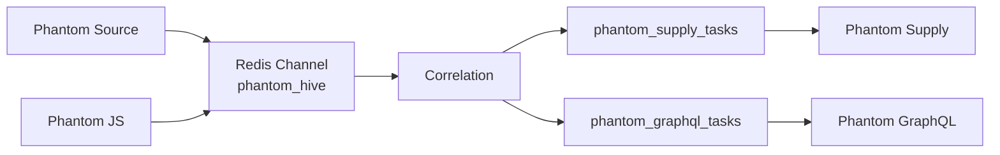

# Event Model

## Purpose

This document defines the event communication model implemented by Phantom Ecosystem.

It describes how intelligence is represented, transported, correlated, delegated, and consumed across the internal event-driven architecture.

The document focuses exclusively on event flow and communication contracts.

Infrastructure details, deployment topology, and module behavior are documented separately.

---

## Overview

Phantom Ecosystem uses an event-driven communication model.

Rather than invoking other services directly, producer modules publish normalized intelligence events to a shared Redis Pub/Sub channel.

The Phantom Correlation Engine evaluates these events and, when an implemented correlation rule matches, publishes a delegated task to the appropriate consumer channel.

Every event follows the same communication lifecycle regardless of its originating module.

---

## Event Lifecycle

Every supported event follows six stages.

```text
Detection

↓

Publication

↓

Transport

↓

Correlation

↓

Delegation

↓

Consumption
```

Each stage has a single responsibility.

---

## Detection

Events originate inside producer modules.

The producer is responsible for:

- Detecting intelligence
- Validating the finding
- Applying local filtering
- Performing local deduplication when implemented
- Publishing a normalized event

The producer does not decide which consumer will process the intelligence.

---

## Publication

After detection, the producer publishes the event to Redis.

Current ingress channel:

```text
phantom_hive
```

The producer immediately continues its own execution.

Publication is asynchronous.

---

## Transport

Redis transports events using Pub/Sub.

Redis does not:

- Store events
- Queue messages
- Retry delivery
- Replay previous events

Delivery is ephemeral.

Only subscribers connected at publication time receive the event.

---

## Correlation

Phantom Correlation subscribes to:

```text
phantom_hive
```

For every received event it:

1. Parses the payload.
2. Identifies the event type.
3. Evaluates implemented rules.
4. Determines whether delegation is required.

Each event is evaluated independently.

---

## Delegation

When a rule matches:

Phantom Correlation performs two independent actions.

### Discord notification

The Hive Mind webhook receives a notification describing the correlation.

---

### Task publication

A task is published to the corresponding Redis channel.

Examples:

```text
phantom_supply_tasks
phantom_graphql_tasks
```

The delegated task contains only the information required by the consumer.

---

## Consumption

Consumer modules subscribe to their own task channel.

Upon receiving a task they:

- Validate the payload
- Execute their specialized workflow
- Report results directly to Discord

Consumers do not send results back to Phantom Correlation.

---

## Current Event Producers

The current implementation contains two producers.

| Module | Event Type |
|---------|------------|
| Phantom Source | Supported package or dependency intelligence from repository activity |
| Phantom JS | Bearer tokens and administrative endpoints |

Additional producers may be added without changing the communication model.

---

## Current Event Consumers

Current consumers are:

| Module | Task Channel |
|---------|--------------|
| Phantom Supply | phantom_supply_tasks |
| Phantom GraphQL | phantom_graphql_tasks |

Each consumer subscribes only to its own delegated task channel.

---

## Redis Channel Model

The implemented channel topology contains one ingress channel and specialized task channels.

### Shared ingress

```text
phantom_hive
```

Receives intelligence from all producers.

---

### Delegated task channels

```text
phantom_supply_tasks

phantom_graphql_tasks
```

Receive work generated by the Correlation Engine.

---

## Event Flow



---

### JavaScript Chain

```text
Phantom JS

↓

phantom_hive

↓

Phantom Correlation

↓

phantom_graphql_tasks

↓

Phantom GraphQL
```

---

## Event Ownership

Each event has exactly one producer.

The producer owns:

- Detection
- Validation
- Publication

After publication the producer relinquishes ownership.

The Correlation Engine becomes responsible only for delegation.

Consumers own execution of delegated tasks.

---

## Delivery Guarantees

The communication model intentionally provides no delivery guarantees.

The system does not implement:

- acknowledgements
- retries
- persistence
- replay
- delivery confirmation

This behavior matches Redis Pub/Sub semantics.

---

## Ordering

Events are processed independently.

The current implementation does not guarantee:

- global ordering
- consumer synchronization
- event sequencing
- transactional execution

Modules must tolerate independent event arrival.

---

## Event State

Events are immutable after publication.

The Correlation Engine evaluates received data without modifying historical events.

Delegated task payloads are newly generated messages rather than updates to previous events.

---

## Deduplication

Deduplication occurs at the collection edge.

Producer modules may implement local strategies before publication.

Example:

- Commit SHA cache
- Local state files
- Runtime memory

Phantom Correlation performs no event deduplication.

---

## Event Persistence

Events are intentionally ephemeral.

They are not stored in:

- Redis
- Phantom Correlation
- Central databases

After delivery they cease to exist.

---

## Failure Behavior

### Producer unavailable

No event is generated.

---

### Redis unavailable

Events cannot be transported.

---

### Correlation unavailable

Published events are lost.

---

### Consumer unavailable

Delegated tasks are lost.

---

### Consumer failure

Consumers are responsible for handling failures within their own execution.

The Correlation Engine is unaware of consumer failures.

---

## Event Expansion

The model supports future producers without architectural changes.

New producers simply publish to:

```text
phantom_hive
```

New consumers receive their own task channel.

No existing producer requires modification.

---

## Communication Principles

The implemented event model follows these principles.

### Asynchronous

Modules never wait for one another.

---

### Stateless

No historical event context exists.

---

### Loosely coupled

Modules communicate through Redis rather than direct service invocation.

---

### Independent

Every module controls its own execution lifecycle.

---

### Specialized

Delegated work is always executed by the module responsible for that domain.

---

## Current Limitations

The current implementation includes:

- One ingress channel
- Two delegated task channels
- Two producers
- Two consumers
- Stateless Correlation Engine
- Ephemeral Redis transport
- No acknowledgements
- No retries
- No replay
- No persistence

These limitations describe the implemented communication model.

---

## Event Model Summary

```text
Producer

↓

Detection

↓

Publication

↓

phantom_hive

↓

Redis

↓

Correlation

↓

Rule Evaluation

↓

Discord Notification

↓

Task Channel

↓

Consumer

↓

Discord Result
```

The event model enables specialized Phantom services to exchange intelligence through a lightweight asynchronous communication layer while maintaining complete module autonomy.

---

## Related Documentation

- [`architecture.md`](architecture.md)
- [`deployment.md`](deployment.md)
- [`infrastructure.md`](infrastructure.md)
- [`hive-mind.md`](hive-mind.md)
- [`security-model.md`](security-model.md)
- [`modules.md`](modules.md)