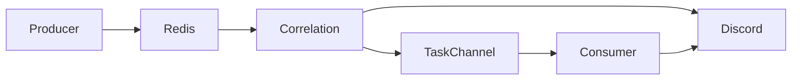
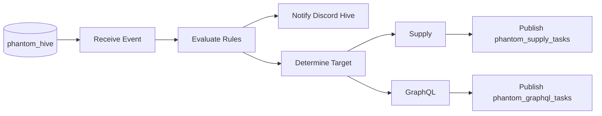

# Hive Mind

## Purpose

This document describes the Hive Mind, the internal event-driven intelligence system of Phantom Ecosystem.

It defines how autonomous services exchange intelligence, how events are correlated, how delegated tasks are generated, and how specialized modules collaborate without direct dependencies.

The Hive Mind is implemented through Redis Pub/Sub and the Phantom Correlation Engine.

---

## Overview

Most Phantom modules operate independently.

They monitor their assigned security domain, analyze targets, and report findings directly to Discord.

Some findings, however, become significantly more valuable when another specialized service continues the investigation.

The Hive Mind enables this cooperation.

Rather than calling another module directly, producers publish normalized intelligence to an internal event bus.

The Correlation Engine evaluates the incoming intelligence, determines whether an implemented correlation rule applies, and delegates follow-up work to the appropriate consumer.

This architecture allows modules to remain autonomous while still collaborating when valuable intelligence is discovered.

---

## Design Philosophy

The Hive Mind follows five fundamental principles.

### Event-driven communication

Modules communicate through events rather than direct service calls.

---

### Loose coupling

Producers never invoke consumer modules directly.

They publish intelligence without knowing which services may process it.

---

### Stateless coordination

The Correlation Engine maintains no persistent knowledge of previous events.

Each event is evaluated independently.

---

### Delegated specialization

The module that discovers intelligence is not necessarily the module best suited to exploit it.

The Hive Mind delegates specialized work to the module responsible for that domain.

---

### Autonomous execution

Delegated modules execute independently.

The Correlation Engine does not supervise their execution or collect their results.

---

## High-Level Architecture



---

## Components

The Hive Mind consists of four logical components.

### Producers

Modules that publish intelligence.

---

### Redis

The internal event transport.

---

### Phantom Correlation

The event correlation engine.

---

### Consumers

Modules that receive delegated tasks.

---

## Producer Modules

The current implementation contains two producers.

| Module | Published intelligence |
|---------|------------------------|
| Phantom Source | Supported package and dependency intelligence extracted from repository activity |
| Phantom JS | Bearer tokens and hidden administrative URIs |

Both publish events to the shared Hive channel.

```text
phantom_hive
```

---

## Shared Intelligence Channel

All supported intelligence enters the Hive through one Redis Pub/Sub channel.

```text
phantom_hive
```

The Correlation Engine subscribes to this channel.

No consumer module subscribes directly to it.

This allows the Correlation Engine to remain the only component responsible for evaluating event relationships.

---

## Phantom Correlation

Phantom Correlation is the central coordination service of the Hive Mind.

Its responsibilities are limited to:

1. Receive events.
2. Evaluate implemented rules.
3. Notify the Hive Mind Discord channel.
4. Publish delegated tasks.

It does not execute offensive workflows itself.

---

## Correlation Workflow



---

## Correlation Rules

The current implementation contains two active correlation chains.

---

### Source → Supply

Producer:

```text
Phantom Source
```

Event:

```text
Discovered package or dependency
```

Consumer:

```text
Phantom Supply
```

Task channel:

```text
phantom_supply_tasks
```

Purpose:

Attempt Dependency Confusion validation.

---

### JavaScript → GraphQL

Producer:

```text
Phantom JS
```

Event:

```text
Bearer Token
```

Consumer:

```text
Phantom GraphQL
```

Task channel:

```text
phantom_graphql_tasks
```

Purpose:

Attempt authenticated GraphQL introspection.

---

## Redis Channels

The current channel topology consists of one ingress channel and module-specific task channels.

### Ingress

```text
phantom_hive
```

Receives intelligence from producers.

---

### Task Channels

```text
phantom_supply_tasks
phantom_graphql_tasks
```

Receive delegated work from Phantom Correlation.

---

## Consumer Modules

Current consumers are:

| Module | Task Channel |
|---------|--------------|
| Phantom Supply | phantom_supply_tasks |
| Phantom GraphQL | phantom_graphql_tasks |

Consumers subscribe only to their own task channel.

---

## Discord Notifications

The Hive Mind reports correlation decisions through a dedicated Discord webhook.

These notifications describe:

- matched rule
- delegated module
- generated task

Consumer modules later report their own findings independently.

The Correlation Engine does not receive these results.

---

## FastAPI Ingress

Phantom Correlation includes an internal FastAPI endpoint.

```text
/api/v1/ingest
```

Authentication:

```text
X-Hive-Secret
```

Current purpose:

Internal ingress.

Future purpose:

Allow remote agents to inject intelligence into the Hive without direct Redis access.

The endpoint currently remains internal to the Docker network.

---

## Event Participation

Every Phantom service can reach Redis.

However, only a subset currently participates in the Hive.

### Active Producers

- Phantom Source
- Phantom JS

### Active Consumers

- Phantom Supply
- Phantom GraphQL

All remaining services continue operating independently.

---

## Communication Model

The Hive Mind is intentionally asynchronous.

The producer never waits for the consumer.

The consumer never responds to the producer.

The Correlation Engine never waits for task completion.

Every stage operates independently.

---

## Stateless Design

The Correlation Engine stores no persistent information.

It maintains:

- no database
- no event history
- no task history
- no deduplication
- no execution tracking

Only temporary Python runtime memory exists.

Restarting the container resets its internal state completely.

---

## Failure Model

Redis Pub/Sub provides ephemeral delivery.

If a subscriber is unavailable during publication:

- the event is lost;
- the Correlation Engine does not retry it;
- the producer is not notified;
- no replay mechanism exists.

This behavior is intentional.

---

## Future Expansion

The current architecture was designed to allow additional producers and consumers without modifying existing communication principles.

Future modules may:

- publish to `phantom_hive`;
- subscribe to their own task channel;
- inject intelligence through FastAPI.

The communication model remains identical regardless of the number of participating services.

---

## Current Limitations

The current Hive Mind implementation has the following limitations:

- Two producers.
- Two consumers.
- One Correlation Engine.
- Stateless coordination.
- No delivery guarantees.
- No retries.
- No acknowledgements.
- No event replay.
- No centralized task tracking.

These limitations describe the current implementation and should not be interpreted as planned functionality.

---

## Hive Mind Summary

```text
Producer

↓

phantom_hive

↓

Redis Pub/Sub

↓

Phantom Correlation

↓

Hive Mind Discord

↓

Task Channel

↓

Consumer

↓

Consumer Discord
```

The Hive Mind enables independent Phantom services to collaborate through event-driven intelligence while preserving loose coupling, module autonomy, and a stateless coordination model.

---

## Related Documentation

- [`architecture.md`](architecture.md)
- [`deployment.md`](deployment.md)
- [`infrastructure.md`](infrastructure.md)
- [`event-model.md`](event-model.md)
- [`security-model.md`](security-model.md)
- [`modules.md`](modules.md)