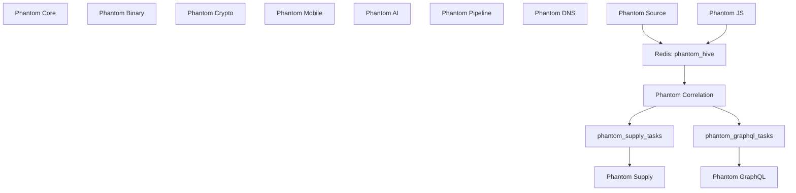

# Modules

## Purpose

This document provides an implementation-aligned overview of the twelve services that compose the Phantom Ecosystem.

The operational source code is maintained in private repositories. This public repository documents each service's role, workflow, communication model, and current Hive Mind participation.

---

## Ecosystem Overview

Phantom Ecosystem combines autonomous security-research services with a lightweight Redis Pub/Sub collaboration layer.

Most modules run their own monitoring or analysis loop and report directly to Discord. Only selected services currently publish or consume Hive events.

> Network access to Redis does not imply active event participation. Core, Binary, Crypto, Mobile, AI, Pipeline, and DNS currently operate independently from the Hive flow.

---

## Module Catalog

| Module | Primary domain | Hive role | Detailed documentation |
|--------|----------------|-----------|------------------------|
| Phantom Core | Web asset reconnaissance and secret discovery | None | [phantom-core.md](modules/phantom-core.md) |
| Phantom Source | Source code repository intelligence | Producer | [phantom-source.md](modules/phantom-source.md) |
| Phantom Binary | Binary monitoring and reverse engineering | None | [phantom-binary.md](modules/phantom-binary.md) |
| Phantom Crypto | Smart contract and Web3 security analysis | None | [phantom-crypto.md](modules/phantom-crypto.md) |
| Phantom Mobile | Android application security analysis | None | [phantom-mobile.md](modules/phantom-mobile.md) |
| Phantom AI | Machine learning repository security analysis | None | [phantom-ai.md](modules/phantom-ai.md) |
| Phantom Pipeline | CI/CD pipeline and build-log inspection | None | [phantom-pipeline.md](modules/phantom-pipeline.md) |
| Phantom DNS | DNS reconnaissance and subdomain takeover detection | None | [phantom-dns.md](modules/phantom-dns.md) |
| Phantom Supply | Software supply chain and dependency confusion validation | Consumer | [phantom-supply.md](modules/phantom-supply.md) |
| Phantom GraphQL | GraphQL endpoint and schema exposure validation | Consumer | [phantom-graphql.md](modules/phantom-graphql.md) |
| Phantom JS | Frontend JavaScript security intelligence | Producer | [phantom-js.md](modules/phantom-js.md) |
| Phantom Correlation | Event correlation and task delegation | Coordinator | [phantom-correlation.md](modules/phantom-correlation.md) |

---

## Current Hive Mind Participation

| Module | Role | Current communication |
|--------|------|-----------------------|
| Phantom Source | Producer | Publishes supported package or dependency intelligence to `phantom_hive` |
| Phantom JS | Producer | Publishes supported bearer-token and administrative-endpoint intelligence to `phantom_hive` |
| Phantom Correlation | Coordinator | Subscribes to `phantom_hive` and publishes one-way delegated tasks |
| Phantom Supply | Consumer | Subscribes to `phantom_supply_tasks` |
| Phantom GraphQL | Consumer | Subscribes to `phantom_graphql_tasks` |

Consumer results are reported directly to their own Discord channels and do not return to Phantom Correlation.

---

## Independent Services

The following modules currently perform no active Redis Pub/Sub communication at the application level:

- Phantom Core
- Phantom Binary
- Phantom Crypto
- Phantom Mobile
- Phantom AI
- Phantom Pipeline
- Phantom DNS

These services remain connected to the shared Docker network but execute and report independently.

---

## Related Documentation

- [architecture.md](architecture.md)
- [deployment.md](deployment.md)
- [infrastructure.md](infrastructure.md)
- [hive-mind.md](hive-mind.md)
- [event-model.md](event-model.md)
- [security-model.md](security-model.md)
